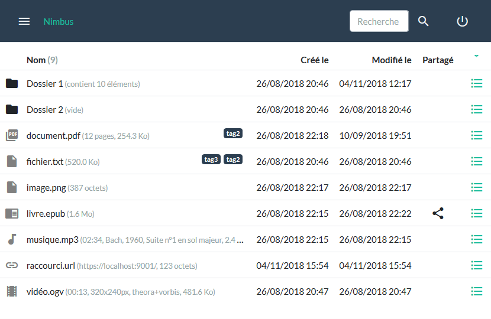
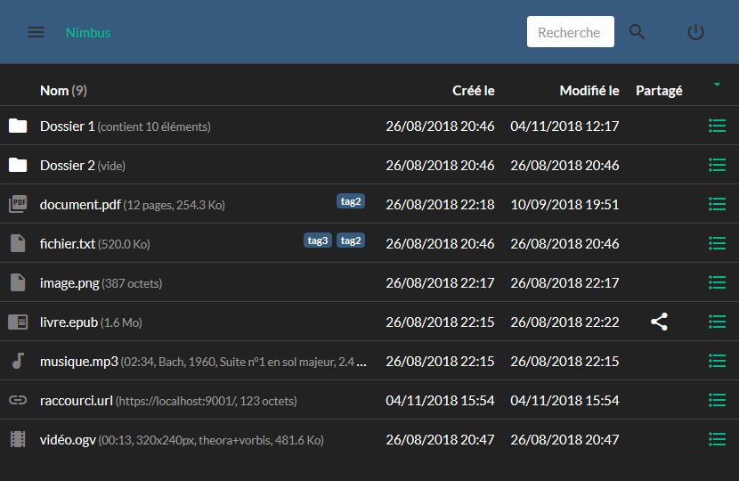

# Nimbus

## Présentation

`Nimbus` est un projet de *cloud personnel* qui se veut facile à installer, extensible et respectueux de votre vie privée.

Le développement du projet s'organise selon 4 axes :
- *le cœur de l'application*, côté serveur en Java et côté client en JavaScript
- *des extensions Java* côté serveur pour gérer les différents types de fichier (PDF, audio, vidéo, ...)
- *des extensions JavaScript* côté client définissant le comportement en fonction du fichier (affichage, propriétés, actions, ...)
- *des applications annexes* (lecteur audio, éditeur de texte, ...) utilisant le cloud comme espace de stockage

Autres thèmes : [thème par défaut](./doc/main-page-1-default.png), [thème Ubuntu](./doc/main-page-4-united.png) et [thème Material Design](./doc/main-page-5-materia.png)

## Technologies

`Nimbus` fonctionne actuellement avec les technologies suivantes :

Dépendance | Type | Version | Utilité | Fichiers
-----------|------|---------|---------|---------
[Spark](http://sparkjava.com/) | Java | 2.7.2 | Apache 2.0 | Framework Java pour application web
[MongoDB](https://mongodb.github.io/mongo-java-driver/) | Java | 3.8.0 | Apache 2.0 | Persistance
[Commons IO](https://commons.apache.org/proper/commons-io/) | Java | 2.6 | Apache 2.0 | Utilitaire
[FreeMarker](https://freemarker.apache.org/) | Java | 2.3.28 | Apache 2.0 | Template de page
[Gson](https://github.com/google/gson) | Java | 2.8.5 | Apache 2.0 | Support du format JSON
[iTextPDF](http://developers.itextpdf.com/itext-java) | plugin Java | 5.5.13 | AGPL | Support des fichiers PDF (à remplacer par [OpenPDF](https://github.com/LibrePDF/OpenPDF/) ?)
[Image4j](http://image4j.sourceforge.net/) | plugin Java | 0.7.1 | LGPL | Support des fichiers ICO et BMP
[MetadataExtractor](https://github.com/drewnoakes/metadata-extractor/releases) | plugin Java | 2.11.0 | Apache 2.0 | Support des métadonnées (EXIF/GPS) des images JPEG
[Jave](http://www.sauronsoftware.it/projects/jave/download.php) | plugin Java | 1.0.2 | GPL | Support audio et vidéo grâce à FFmpeg
[JavaZoom](http://www.javazoom.net/index.shtml) | plugin Java | 2010 | LGPL | Support des fichiers MP3 et OGG
[jQuery](http://api.jquery.com/) | JS | 3.3.1 | ~MIT | Kit de départ pour le JS
[Bootstrap](https://getbootstrap.com/) | CSS/JS | 4.1.3 | MIT | Kit de départ pour l'IHM
[Popper.js](https://popper.js.org/) | JS | 1.14.4 (umd) | MIT | Dépendance de Bootstrap pour tooltip, popover, dropdown, ...
[Bootswatch](https://bootswatch.com/) | CSS | 4.1.3 | MIT | Thèmes pour Boostrap
[Material Icons](https://material.io/icons/) | CSS | 3.0.1 | Apache 2.0 | Icônes sous forme de WebFont
[ePub.js](https://github.com/futurepress/epub.js/releases) | plugin JS | 0.3.66 | Free BSD | Support des fichiers ePub
[JSZip](https://github.com/Stuk/jszip/releases) | plugin JS | 3.1.5 | MIT or GPLv3 | Dépendances de ePub.js
[PDF.js](https://mozilla.github.io/pdf.js/) | plugin JS | 1.10.100 | Apache 2.0 | Support des fichiers PDF

## Fonctionnalités

Le tableau suivant dresse la liste des fonctionnalités formant le cœur de `Nimbus` :

Statut | Fonctionnalité
-------|----------------
En cours | Installation simplifiée
Fait | Configuration simplifiée avec un seul fichier de configuration
Fait | Accès authentifié depuis un navigateur en HTTPS
Fait | Multi-utilisateurs avec profils administrateur ou standard
Fait | Bilingue français/anglais (au minimum) et extensible (application et plugins)
Fait | Stockage des fichiers et organisation en dossier (arborescence)
Fait | Gestion des quotas d'espace disque (par un des administrateurs)
Fait | Gestion des partages de fichier (protégé par mot de passe et avec expiration si souhaitée)
Fait | Gestion de la corbeille
Fait | Extraction automatique des propriétés (dimension des images, durée d'une vidéo, auteur d'un MP3, ...)
Fait | Support extensible de différents types de fichiers côté client (plugins)
Fait | Support des thèmes grâce à Bootstrap (default) et Bootswatch (flatly, darkly, ...)
Partiel | Import, export et téléchargement simplifié des fichiers/dossiers
Partiel | Tests automatisables
 | Applications annexes
