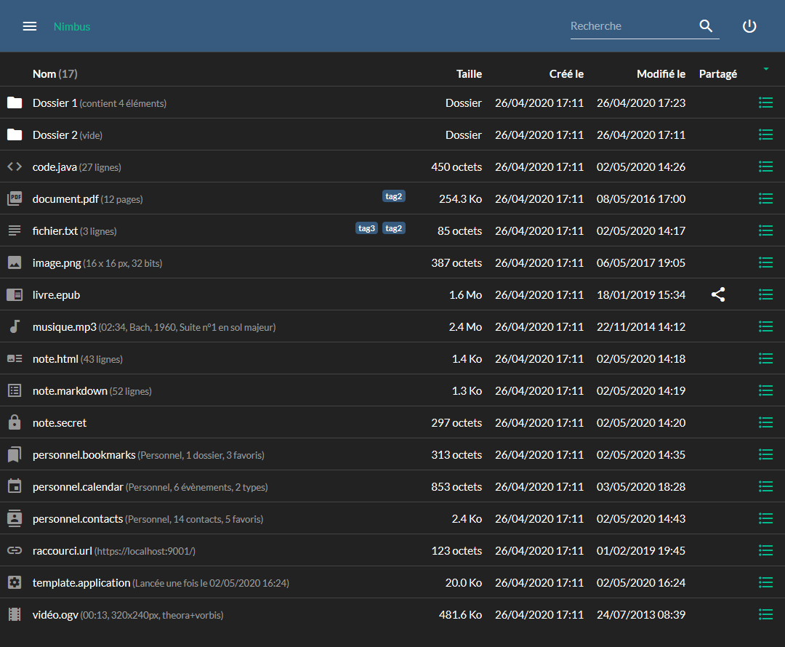

# Nimbus

- [Présentation](#user-content-présentation)
- [Technologies](#user-content-technologies)
- [Fonctionnalités](#user-content-fonctionnalités)
- [Fichiers supportés](#user-content-fichiers-supportés)
- [Installation](#user-content-installation)
- [Import](#user-content-import)
- [Synchronisation](#user-content-synchronisation)

## Présentation

`Nimbus` est un projet de *cloud personnel* qui se veut facile à installer, extensible et respectueux de votre vie privée.

Le développement du projet s'organise selon 4 axes :
- *le cœur de l'application*, côté serveur en Java et côté client en JavaScript
- *des extensions Java* côté serveur pour gérer les différents types de fichier (PDF, audio, vidéo, ...)
- *des extensions JavaScript* côté client définissant le comportement en fonction du fichier (affichage, propriétés, actions, ...)
- *des applications annexes* (lecteur audio, éditeur de texte, ...) utilisant le cloud comme espace de stockage




## Technologies

`Nimbus` fonctionne actuellement avec les technologies suivantes :

Dépendance | Type | Version | Utilité | Fichiers
-----------|------|---------|---------|---------
[Nimbus Java API](https://github.com/guillaumeprevot/nimbus-java-api) | Java | [1.0-SNAPSHOT](https://github.com/guillaumeprevot/nimbus-java-api/releases) | MIT | Routing API
[Jetty](https://www.eclipse.org/jetty/) | Java | [9.4.29](https://www.eclipse.org/jetty/download.html) | Apache 2.0 / EPL 1.0 | Serveur Web
[FreeMarker](https://freemarker.apache.org/) | Java | [2.3.30](https://freemarker.apache.org/freemarkerdownload.html) | Apache 2.0 | Template de page
[Gson](https://github.com/google/gson) | Java | [2.8.6](https://github.com/google/gson/releases) | Apache 2.0 | Support du format JSON
[SLF4J](http://www.slf4j.org/) | Java | [1.7.30](http://www.slf4j.org/download.html) | MIT | Gestion des logs
[MongoDB](https://mongodb.github.io/mongo-java-driver/) | Java | [3.12.4](https://www.mvnrepository.com/artifact/org.mongodb/mongodb-driver) | Apache 2.0 | Persistance
[Commons IO](https://commons.apache.org/proper/commons-io/) | Java | [2.6](https://commons.apache.org/proper/commons-io/download_io.cgi) | Apache 2.0 | Utilitaire
[Commons Lang](https://commons.apache.org/proper/commons-lang/) | Java | [3.10](https://commons.apache.org/proper/commons-lang/download_lang.cgi) | Apache 2.0 | Utilitaire
[PDFBox](https://pdfbox.apache.org/) | plugin Java | [2.0.19](https://pdfbox.apache.org/) | Apache 2.0 | Support des fichiers PDF
[MetadataExtractor](https://github.com/drewnoakes/metadata-extractor/) | plugin Java | [2.14.0](https://github.com/drewnoakes/metadata-extractor/releases) | Apache 2.0 | Support des métadonnées (EXIF/GPS) des images JPEG
[Image4j](http://image4j.sourceforge.net/) | plugin Java | [0.7.1](./lib/image4j/) | LGPL | Support des fichiers ICO et BMP
[Jave](http://www.sauronsoftware.it/projects/jave/download.php) | plugin Java | [1.0.2](./lib/jave/) | GPL | Support audio et vidéo grâce à FFmpeg
[JavaZoom](http://www.javazoom.net/index.shtml) | plugin Java | [2010](./lib/javazoom/) | LGPL | Support des fichiers MP3 et OGG
[JAudiotagger](http://www.jthink.net/jaudiotagger/) | plugin Java | [2.2.5](https://dl.bintray.com/ijabz/maven/net/jthink/jaudiotagger/) | LGPL | Support des fichiers MP3, MP4, OGG, FLAC, WAV, AIF, Dsf, Wma
[mp3agic](https://github.com/mpatric/mp3agic) | plugin Java | [0.9.1](https://github.com/mpatric/mp3agic/releases) | MIT | Support des fichiers MP3
[Bouncy Castle](https://www.bouncycastle.org/java.html) | transitive | [1.65.01](https://www.bouncycastle.org/latest_releases.html) | MIT | Dépendance de PDFBox, comme iTextPDF, pour certains documents
[jQuery](http://api.jquery.com/) | JS | [3.5.1](https://jquery.com/download/) | ~MIT | Kit de départ pour le JS
[Bootstrap](https://getbootstrap.com/) | CSS/JS | [4.5.0](https://github.com/twbs/bootstrap/releases) | MIT | Kit de départ pour l'IHM
[Bootswatch](https://bootswatch.com/) | CSS | [4.5.0](https://github.com/thomaspark/bootswatch/releases) | MIT | Thèmes pour Bootstrap dont Flatly et Darkly
[Material Icons](https://material.io/icons/) | CSS | [v50](https://fonts.googleapis.com/css?family=Material+Icons) | Apache 2.0 | Icônes sous forme de WebFont
[ePub.js](https://github.com/futurepress/epub.js) | plugin JS | [0.3.73](https://github.com/futurepress/epub.js/releases) | Free BSD | Support des fichiers ePub
[PDF.js](https://mozilla.github.io/pdf.js/) | plugin JS | [2.3.200](https://github.com/mozilla/pdf.js/releases) | Apache 2.0 | Support des fichiers PDF
[Marked.js](https://marked.js.org/#/README.md) | plugin JS | [1.1.0](https://github.com/markedjs/marked/releases) | MIT | Prévisualisation du Markdown
[Prism.js](https://prismjs.com/) | plugin JS | [1.20.0](https://github.com/PrismJS/prism/releases) | MIT | Coloration syntaxique des blocs de code
[CodeMirror](https://codemirror.net/) | plugin JS | [5.54.0](https://codemirror.net/) | MIT | Editeur de code avec coloration syntaxique notamment
[DOMPurify](https://github.com/cure53/DOMPurify) | plugin JS | [2.0.11](https://github.com/cure53/DOMPurify/releases) | Apache 2.0 / MPL 2.0 | Assainit le contenu des notes avant utilisation
[Moment.js](https://momentjs.com/docs/) | plugin JS | [2.26.0](https://github.com/moment/moment/releases) | MIT | Manipulation des dates et heures (agenda)
[Popper.js](https://popper.js.org/) | transitive | [1.16.1 (umd)](https://github.com/popperjs/popper-core/releases) | MIT | Dépendance de Bootstrap pour tooltip, popover, dropdown, ...
[Lato](https://fonts.google.com/specimen/Lato) | transitive | [v16](https://fonts.googleapis.com/css?family=Lato:300,400,700,400italic&display=swap) | OFL | WebFont pour les thèmes Flatly et Darkly
[JSZip](https://github.com/Stuk/jszip) | transitive | [3.3.0](https://github.com/Stuk/jszip/releases) | MIT or GPLv3 | Dépendances de ePub.js

## Fonctionnalités

Le tableau suivant dresse la liste des fonctionnalités formant le cœur de `Nimbus` :

Statut | Fonctionnalité
-------|----------------
Fait | Configuration simplifiée avec un seul fichier de configuration
Fait | Accès authentifié depuis un navigateur en HTTPS
Fait | Multi-utilisateurs avec profils administrateur ou standard
Fait | Bilingue français/anglais (au minimum) et extensible (application et plugins)
Fait | Stockage des fichiers et organisation en dossier (arborescence)
Fait | Gestion des quotas d'espace disque (par un des administrateurs)
Fait | Gestion des partages de fichier (protégé par mot de passe et avec expiration si souhaitée)
Fait | Gestion de la corbeille
Fait | Gestion des fichiers et dossiers masqués
Fait | Extraction automatique des propriétés (dimension des images, durée d'une vidéo, auteur d'un MP3, ...)
Fait | Support extensible de différents types de fichiers côté client (plugins)
Fait | Support des thèmes clair et sombre (Flatly/Darkly pour l'IHM + création de 2 thèmes pour CodeMirror)
Fait | Import, export et téléchargement simplifié des fichiers/dossiers
Fait | Tests automatisés (mais à compléter au fur et à mesure)
Fait | Installation simplifiée
Fait | Documentation (présentation, technologies, installation, import, synchronisation)
À continuer | Documentation (types de fichier supportés, facets, plugins, applications) 
Fait | Applications annexes (image, audio, video, epub, pdf, url, texte, markdown, code, calendrier, contacts, bookmarks)
À étudier | Applications annexes (checksums, TODO, wiki, RSS, messagerie... il y a tellement de possibilités !)
Fait | Synchronisation (dossier local vers serveur et serveur vers dossier local)
À étudier | Synchronisation (bi-directionnelle et/ou temps réel)

## Fichiers supportés

Il est possible de stocker tout type de fichier dans `Nimbus` et, quand le format du fichier est reconnu, des fonctions supplémentaires sont disponibles :

- Documents ePUB :
    - les documents `.epub` peuvent être consultés dans Nimbus, grâce à [EPUB.js](https://github.com/futurepress/epub.js), en utilisant l'action *Lire*
- Documents PDF :
    - les documents `.pdf` peuvent être consultés dans Nimbus, grâce à [PDF.js](https://github.com/mozilla/pdf.js), en utilisant l'action *Lire*
    - le nombre de pages, la taille des pages et les minatures sont disponibles lors de la navigation grâce à [PDFBox](https://pdfbox.apache.org/)
- Raccourcis Windows :
    - les raccourcis `.url`, créés au départ dans Windows, peuvent être ouverts depuis Nimbus en utilisant l'action *Ouvrir ce raccourci*
    - de plus, l'icône éventuelle sert de miniature si ces dernières sont activées lors de la navigation
- Vidéos :
    - les vidéos (`.mp4`, `.ogg`, `.webm`, ...) [supportées par le navigateur](https://www.w3schools.com/tags/tag_video.asp) peuvent être visionnées dans Nimbus en utilisant l'action *Lancer la vidéo*
    - les sous-titres WebVTT (`.vtt`) sont détectés et proposés lors de la lecture d'une vidéo
    - les sous-titres SubRip (`.srt`) peuvent être convertis en WebVTT (vtt) en utilisant l'action `Convertir en WebVTT`, basée sur [ce code](http://www.webvtt.org/)
    - plusieurs propriétés (durée, codecs, ...) sont extraites de nombreux formats afin d'être disponibles lors de la navigation
- Audio :
    - les fichiers audio (`.mp3`, `.ogg`, `wav`, ...) [supportés par le navigateur](https://www.w3schools.com/tags/tag_audio.asp) peuvent être écoutés dans Nimbus en utilisant les actions `Ouvrir` ou `Ajouter`
    - plusieurs propriétés (durée, auteur, album, ...) sont extraites de nombreux formats afin d'être disponibles lors de la navigation
- Images :
    - les images (`.jpeg`, `.png`, ...) [supportées par le navigateur](https://developer.mozilla.org/en-US/docs/Web/HTML/Element/Img) peuvent être visualisées dans le `Diaporama` de Nimbus
    - plusieurs propriétés (dimensions, coordonnées GPS, ...) peuvent être extraites de différents formats afin d'être disponibles lors de la navigation
- Markdown :
    - les notes au format Markdown (`.markdown` ou `.md`) peuvent être saisies et prévisualisées dans Nimbus, grâce à [Marked.js](https://github.com/markedjs/marked), en utilisant l'action `Ouvrir dans l'éditeur Markdown`
	- la coloration syntaxique des blocs de code est faite grâce à [Prism.js](https://github.com/PrismJS/prism) ou [CodeMirror](https://codemirror.net/) (cf *client.code.highlighter* dans *nimbus.conf*)
- Fichiers texte :
    - les fichiers texte (cf *text.file.extensions* dans *nimbus.conf*) peuvent être édités dans Nimbus en utilisant l'action `Ouvrir dans l'éditeur de texte`
    - les notes au format HTML (`.html` ou `.note`), peuvent être éditées dans Nimbus grâce à une application WYSIWYG dédiée
    - le `code source` peut être édité dans Nimbus grâce à [CodeMirror](https://codemirror.net/) en utilisant l'action `Ouvrir dans l'éditeur de code`

De plus, une action générale `Ouvrir` permet d'ouvrir le fichier dans le navigateur, quand ce dernier supporte ce format de fichier.

Enfin, certaines extensions sont interprétées comme fichiers contenant les données d'applications intégrées à Nimbus 

- Notes chiffrées
    - l'extension `.secret` est utilisée par l'application de prise de notes chiffrées accessible en utilisant l'action `Afficher ou modifier le contenu`
	- le chiffrement se fait côté client en *AES 256 bits GCM* grâce à [Web Crypto API](https://developer.mozilla.org/en-US/docs/Web/API/Crypto), intégrée aux navigateurs
- Agenda
	- l'agenda permet de combiner un ou plusieurs fichiers `.calendar`, par exemple *personnel.calendar* et *professionnel.calendar*
    - l'application est accessible via le menu général `Ouvrir l'application Agenda` ou l'action `Ouvrir dans l'application Agenda` de ces fichiers
- Contact
	- le carnet d'adresse est constitué de un ou plusieurs fichiers `.contacts`, par exemple *personnel.contacts* et *professionnel.contacts*
	- l'application est accessible via le menu général `Ouvrir l'application Contacts` ou l'action `Ouvrir dans l'application Contacts` de ces fichiers
- Favoris / Bookmark
	- les favoris Internet (a.k.a. bookmark) sont organisés dans un ou plusieurs fichiers `.bookmarks`, par exemple *personnel.bookmarks* et *professionnel.bookmarks*
	- l'application est accessible via le menu général `Ouvrir l'application Favoris` ou l'action `Ouvrir dans l'application Favoris` de ces fichiers
- Applications
	- l'extension `.application` est utilisée comme marqueur pour des applications HTML/CSS/JS que l'on peut lancer en utilisant l'action `Lancer cette application`
	- [une application fonctionnelle](./doc/template.application.png) est disponible dans `doc/template.application`. Elle permet de générer des squelettes d'application personnalisables

## Installation

**Pré-requis**

Pour fonctionner, `Nimbus` a besoin de [MongoDB](https://www.mongodb.com/download-center/community), [Java](https://www.oracle.com/technetwork/java/javase/downloads/index.html), [Git](https://git-scm.com/) et [Maven](https://maven.apache.org/download.cgi).

**Installation**

Tout d'abord, on récupère le code sur `GitHub` et on compile avec `Maven`

```bash
git clone https://github.com/guillaumeprevot/nimbus-java-api.git
cd nimbus-java-api
mvn install
cd ..
git clone https://github.com/guillaumeprevot/nimbus.git
cd nimbus
mvn install
```

**Configuration**

Ensuite, on configure l'application en éditant `nimbus.conf`

```bash
# Linux
nano nimbus.conf
# Windows
notepad nimbus.conf
```

Par défaut :
- le serveur tourne en HTTP sur le port 10001
    - les propriétés `server.*` permettent d'ajuster cette partie
- le serveur accède à MongoDB en local, sur le port 27017 et crée la base "nimbus"
    - les propriétés `mongo.*` permettent d'ajuster cette partie
- les fichiers sont stockés dans le sous-dossier "storage"
    - la propriété `storage.path` vous permet d'indiquer un autre chemin (relatif ou absolu)
- tous les plugins sont activés côté client (javascript)
    - la propriété `client.plugins` vous permet de limiter les plugins chargés
- seuls les plugins serveur (java) n'utilisant *que* la JRE sont activés
    - les propriétés `facet.*` vous permettent d'activer d'autres plugins sur le serveur

**Exécution**

Enfin, on lance l'application 

```bash
# Linux
java -cp ./bin:./lib/*:./lib/image4j/*:./lib/javazoom/*:./lib/jave/* fr.techgp.nimbus.Application
# Windows
java -cp .\bin;.\lib\*;.\lib\image4j\*;.\lib\javazoom\*;.\lib\jave\* fr.techgp.nimbus.Application
```

La page d'accueil est alors accessible [par défaut ici](http://localhost:10001).

NB: pour la suite, les scripts `nimbus.sh` et `nimbus.bat` pourront servir de base afin d'automatiser le lancement, l'arrêt, la mise à jour et la sauvegarde de l'application.

**Première connexion**

A la [première connexion](http://localhost:10001), le login et le mot de passe entrés serviront à créer un compte avec les privilèges de l'`administrateur`.


Une fois le premier compte créé, on arrive sur la page principale.


 
A vous de jouer !

**Mise à jour**

Pour mettre à jour, il suffit de quelques commandes

```bash
kill $(ps aux | grep '[n]imbus' | awk '{print $2}');

cd /path/to/nimbus-java-api
git pull
mvn install

cd /path/to/nimbus
rm -rf ./bin/*
rm ./lib/*.jar
git pull
mvn install
```

## Import

Au départ, vous aurez probablement beaucoup de données à importer et ça sera plus rapide en le faisant directement sur le serveur.

La classe exécutable `fr.techgp.nimbus.Import` permet donc l'import en ligne de commande d'un dossier du serveur vers Nimbus.

Usage : `java [OPTIONS] fr.techgp.nimbus.Import <login> <folderPath> [<parentId>]`

Options :
- `-Dnimbus.log=...` permet de modifier le fichier de log
- `-Dnimbus.log=none` ne génèrera pas de fichier de log et écrira les traces sur la sorties standard
- `-Dnimbus.conf=...` permet de définir le(s) fichier(s) de configuration à utiliser
- `-Dnimbus.updateFileExistingWithSameSize=true` force la mise à jour des fichiers de même taille
- `-Dnimbus.updateMetadataExistingWithSameSize=true` force la mise à jour des méta-données des fichiers de même taille
- `-Dnimbus.updateTimestampsExistingWithSameSize=true` force la mise à jour des dates (création/modification) des fichiers de même taille
- `-Dorg.slf4j.simpleLogger.log.fr.techgp.nimbus.Import=debug` réduira les traces en n'affichant que les dossiers parcourus

Comportement
- la configuration est en partie extraite de "nimbus.conf" (accès MongoDB, facets, dossier de stockage)
- l'import demande confirmation en indiquant la taille et le nombre d'éléments en entrée
- l'import crée ou complète l'arborescence sous "parentId" pour correspondre à l'arborescence de "folderPath"
- les fichiers sont copiés sauf s'ils existent déjà avec la même taille (voir options ci-dessus pour personnaliser)
- la trace complète est générée dans "nimbus.log" et liste les dossiers et fichiers créés/modifiés/exclus

Exemple : importer le dossier "/media/usb/storage" dans le dossier n°1 de l'utilisateur "adm"
```bash
java fr.techgp.nimbus.Import adm /media/usb/storage 1
```

## Synchronisation

Par la suite, il peut être intéressant de sauvegarder un dossier local sur Nimbus (*upload*) ou, inversement, d'extraire un dossier de Nimbus en local (*download*).

La classe exécutable `fr.techgp.nimbus.sync.SyncMain` permet la synchronisation dans un sens *ou* dans l'autre (la synchro bi-directionnelle ou temps réelle est prévue mais n'est pas encore disponible). 

Usage : `java [OPTIONS] fr.techgp.nimbus.sync.SyncMain <indexes>`

Options en ligne de commande :
- `-Dnimbus.log=...` : le nom d'un fichier de log à utiliser. Sinon, les traces vont sur la sortie standard
- `-Dnimbus.conf=...` : le nom d'un fichier de configuration. Sinon, les options sont passées dans la commande ou demandées à l'utilisateur

Options obligatoires : en ligne de commande (*-Doption=valeur*), dans le fichier de configuration (*option=valeur*) ou de manière interactive (le programme les demandera à l'utilisateur)
- `nimbus.url` : l'URL de votre serveur, par exemple *https://localhost:10001*
- `nimbus.login` : votre nom d'utilisateur Nimbus
- `nimbus.password` : votre mot de passe Nimbus
- `nimbus.direction`(*d* ou *u*) : le sens de synchronisation qui peut être *u* pour *u*pload (local>serveur) ou *d* pour *d*ownload (serveur>local)
- `nimbus.traceOnly` (*y* ou *n*) : si *y*, aucune modification ne sera faite mais le programme indiquera les différences détectées pour permettre de vérifier avant
- `nimbus.skipExistingWithSameDateAndSize` (*y* ou *n*) : si *y*, deux fichiers local/serveur de même date et même taille seront considérés identiques et zappés
- `nimbus.forceHTTPSCertificate` (*y* ou *n*) : si *y*, désactive la vérification du certificat HTTPS présenté par le serveur. C'est déconseillé en dehors des tests
- `nimbus.[index].localFolder` : le chemin complet vers le dossier local, existant, qui sera utilisé pour la synchronisation
- `nimbus.[index].serverFolderId` : l'identifiant du dossier dans Nimbus qui sera utilisé pour la synchronisation (la colonne *N°* peut aider)
- `nimbus.[index].skipItemIds` : la liste des identifiants d'élément sur le serveur à excure de la synchronisation (la colonne *N°* peut aider également)

Comportement :
- la demande de mot de passe se fait de manière sécurisée, si possible grâce à [Console.readPassword()](https://docs.oracle.com/javase/8/docs/api/java/io/Console.html), sinon grâce à un [JPasswordField](https://docs.oracle.com/javase/8/docs/api/javax/swing/JPasswordField.html)
- l'arborescence du dossier du serveur est ensuite chargée récursivement
- l'arborescence est ensuite complétée récursivement avec le contenu du dossier local
- en cas d'upload
    - un fichier local sera ajouté sur le serveur s'il n'existe pas encore
    - un fichier du serveur sera remplacé s'il est différent du fichier local
    - un fichier du serveur n'existant pas/plus en local sera supprimé du serveur
    - la date de modification sur le serveur sera ajustée pour correspondre à celle du fichier
- en cas de download
    - un fichier du serveur sera copié en local s'il n'existe pas encore
    - un fichier local sera remplacé par celui du serveur s'il est différent
    - un fichier local n'existant pas/plus sur le serveur sera supprimé en local
    - la date de modification du fichier sera ajustée pour correspondre à celle du serveur
- dans les 2 cas, les modifications sont tracées dans le fichier de log (si précisé) ou sur la sortie standard

Exemple 1 : envoyer le dossier "/home/user/documents" dans le dossier n°1 de l'utilisateur "adm"
```bash
java -Dnimbus.login=adm -Dnimbus.0.localFolder=/home/user/documents -Dnimbus.0.serverFolderId=1 -Dnimbus.direction=u fr.techgp.nimbus.sync.SyncMain 0
```

Exemple 2 : sauvegarder sur clef USB les données de l'utilisateur "adm", depuis la racine, sauf les dossiers n°2 et 3
```bash
java -Dnimbus.login=adm -Dnimbus.0.localFolder=/home/usb/storage -Dnimbus.0.serverFolderId=root -Dnimbus.0.skipItemIds=2,3 -Dnimbus.direction=d fr.techgp.nimbus.sync.SyncMain 0
```

Le dossier `doc` contient un exemple de fichier de configuration [sync-example.conf](./doc/sync-example.conf) ainsi qu'un exemple de script [sync-example.bat](./doc/sync-example.bat).
