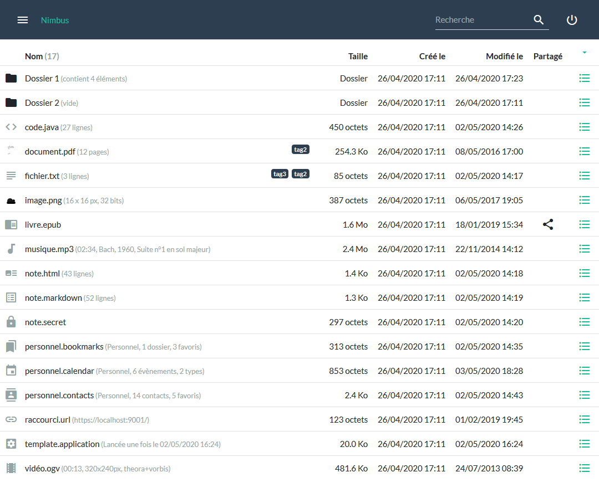
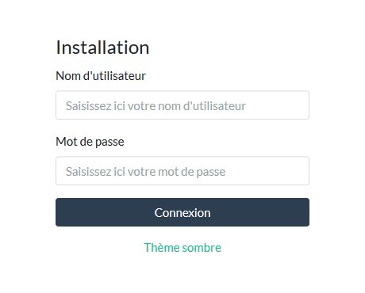
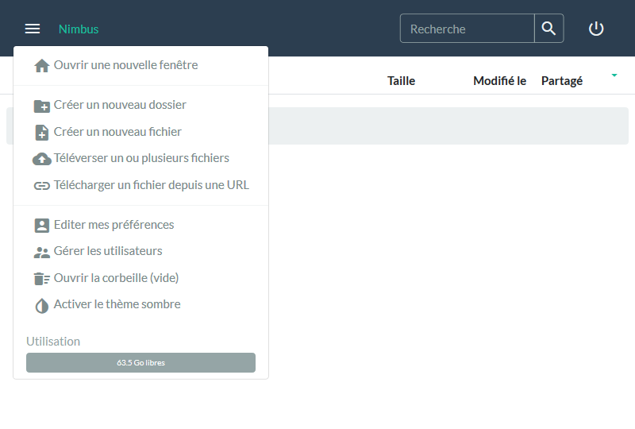

# Nimbus

## Présentation

`Nimbus` est un projet de *cloud personnel* qui se veut facile à installer, extensible et respectueux de votre vie privée.

Le développement du projet s'organise selon 4 axes :
- *le cœur de l'application*, côté serveur en Java et côté client en JavaScript
- *des extensions Java* côté serveur pour gérer les différents types de fichier (PDF, audio, vidéo, ...)
- *des extensions JavaScript* côté client définissant le comportement en fonction du fichier (affichage, propriétés, actions, ...)
- *des applications annexes* (lecteur audio, éditeur de texte, ...) utilisant le cloud comme espace de stockage




## Technologies

`Nimbus` fonctionne actuellement avec les technologies suivantes :

Dépendance | Type | Version | Utilité | Fichiers
-----------|------|---------|---------|---------
[Spark](http://sparkjava.com/) | Java | 2.8.0 | Apache 2.0 | Framework Java pour application web
[MongoDB](https://mongodb.github.io/mongo-java-driver/) | Java | 3.9.1 | Apache 2.0 | Persistance
[Commons IO](https://commons.apache.org/proper/commons-io/) | Java | 2.6 | Apache 2.0 | Utilitaire
[FreeMarker](https://freemarker.apache.org/) | Java | 2.3.28 | Apache 2.0 | Template de page
[Gson](https://github.com/google/gson) | Java | 2.8.5 | Apache 2.0 | Support du format JSON
[iTextPDF](http://developers.itextpdf.com/itext-java) | plugin Java | 5.5.13 | AGPL | Support des fichiers PDF (à remplacer par [OpenPDF](https://github.com/LibrePDF/OpenPDF/) ?)
[Image4j](http://image4j.sourceforge.net/) | plugin Java | 0.7.1 | LGPL | Support des fichiers ICO et BMP
[MetadataExtractor](https://github.com/drewnoakes/metadata-extractor/releases) | plugin Java | 2.11.0 | Apache 2.0 | Support des métadonnées (EXIF/GPS) des images JPEG
[Jave](http://www.sauronsoftware.it/projects/jave/download.php) | plugin Java | 1.0.2 | GPL | Support audio et vidéo grâce à FFmpeg
[JavaZoom](http://www.javazoom.net/index.shtml) | plugin Java | 2010 | LGPL | Support des fichiers MP3 et OGG
[JAudiotagger](http://www.jthink.net/jaudiotagger/) | plugin Java | 2.2.5 | LGPL | Support des fichiers MP3, MP4, OGG, FLAC, WAV, AIF, Dsf, Wma
[mp3agic](https://github.com/mpatric/mp3agic) | plugin Java | 0.9.1 | MIT | Support des fichiers MP3
[jQuery](http://api.jquery.com/) | JS | 3.3.1 | ~MIT | Kit de départ pour le JS
[Bootstrap](https://getbootstrap.com/) | CSS/JS | 4.2.1 | MIT | Kit de départ pour l'IHM
[Popper.js](https://popper.js.org/) | JS | 1.14.6 (umd) | MIT | Dépendance de Bootstrap pour tooltip, popover, dropdown, ...
[Bootswatch](https://bootswatch.com/) | CSS | 4.2.1 | MIT | Thèmes pour Bootstrap dont Flatly et Darkly
[Lato](https://fonts.googleapis.com/css?family=Lato:400,700,400italic) | CSS | v14 | OFL | WebFont pour les thèmes Flatly et Darkly
[Material Icons](https://material.io/icons/) | CSS | 3.0.1 | Apache 2.0 | Icônes sous forme de WebFont
[ePub.js](https://github.com/futurepress/epub.js/releases) | plugin JS | 0.3.73 | Free BSD | Support des fichiers ePub
[JSZip](https://github.com/Stuk/jszip/releases) | plugin JS | 3.1.5 | MIT or GPLv3 | Dépendances de ePub.js
[PDF.js](https://mozilla.github.io/pdf.js/) | plugin JS | 1.10.100 | Apache 2.0 | Support des fichiers PDF
[Marked.js](https://github.com/markedjs/marked) | plugin JS | 0.5.2 | MIT | Prévisualisation du Markdown
[Prism.js](https://github.com/PrismJS/prism) | plugin JS | 1.15.0 | MIT | Coloration syntaxique des blocs de code
[CodeMirror](https://codemirror.net/) | plugin JS | 5.42.2 | MIT | Editeur de code avec coloration syntaxique notamment

## Fonctionnalités

Le tableau suivant dresse la liste des fonctionnalités formant le cœur de `Nimbus` :

Statut | Fonctionnalité
-------|----------------
Fait | Configuration simplifiée avec un seul fichier de configuration
Fait | Accès authentifié depuis un navigateur en HTTPS
Fait | Multi-utilisateurs avec profils administrateur ou standard
Fait | Bilingue français/anglais (au minimum) et extensible (application et plugins)
Fait | Stockage des fichiers et organisation en dossier (arborescence)
Fait | Gestion des quotas d'espace disque (par un des administrateurs)
Fait | Gestion des partages de fichier (protégé par mot de passe et avec expiration si souhaitée)
Fait | Gestion de la corbeille
Fait | Extraction automatique des propriétés (dimension des images, durée d'une vidéo, auteur d'un MP3, ...)
Fait | Support extensible de différents types de fichiers côté client (plugins)
Fait | Support des thèmes clair et sombre (Flatly/Darkly pour l'IHM + création de 2 thèmes pour CodeMirror)
Fait | Import, export et téléchargement simplifié des fichiers/dossiers
Fait | Tests automatisés (mais à compléter au fur et à mesure)
Fait | Installation simplifiée
Fait | Documentation (présentation, technologies, installation, import, synchronisation)
A faire | Documentation (types de fichier supportés, facets, plugins, applications) 
Fait | Applications annexes (diaporama, lecteur audio/vidéo/ePub/PDF, éditeur de code/texte/Markdown)
A faire | Applications annexes (contacts, note, calendrier, messagerie, ... il y a tellement de possibilités !)
Fait | Synchronisation (dossier local vers serveur et serveur vers dossier local)
A faire | Synchronisation (bi-directionnelle et/ou temps réel)

## Installation

**Pré-requis**

Pour fonctionner, `Nimbus` a besoin de [MongoDB](https://www.mongodb.com/download-center/community), [Java](https://www.oracle.com/technetwork/java/javase/downloads/index.html), [Git](https://git-scm.com/) et [Maven](https://maven.apache.org/download.cgi).

**Installation**

Tout d'abord, on récupère le code sur `GitHub` et on compile avec `Maven`

```bash
git clone https://github.com/guillaumeprevot/nimbus.git
cd nimbus
mvn install
```

**Configuration**

Ensuite, on configure l'application en éditant `nimbus.conf`

```bash
# Linux
nano nimbus.conf
# Windows
notepad nimbus.conf
```

Par défaut :
- le serveur tourne en HTTP sur le port 10001
    - les propriétés `server.*` permettent d'ajuster cette partie
- le serveur à MongoDB en local, sur le port 27017 et créer la base "nimbus"
    - les propriétés `mongo.*` permettent d'ajuster cette partie
- les fichiers sont stockés dans le sous-dossier "storage"
    - la propriété `storage.path` vous permet d'indiquer un autre chemin (relatif ou absolu)
- tous les plugins sont activés côté client (javascript)
    - la propriété `client.plugins` vous permet de limiter les plugins chargés
- seuls les plugins serveur (java) n'utilisant *que* la JRE sont activés
    - les propriétés `facet.*` vous permettent d'activer d'autres plugins sur le serveur

**Exécution**

Enfin, on lance l'application 

```bash
# Linux
java -cp ./bin:./lib/*:./lib/image4j/*:./lib/javazoom/*:./lib/jave/* fr.techgp.nimbus.Application
# Windows
java -cp .\bin;.\lib\*;.\lib\image4j\*;.\lib\javazoom\*;.\lib\jave\* fr.techgp.nimbus.Application
```

La page d'accueil est alors accessible [par défaut ici](http://localhost:10001).

NB: pour la suite, les scripts `nimbus.sh` et `nimbus.bat` pourront servir de base afin d'automatiser le lancement, l'arrêt, la mise à jour et la sauvegarde de l'application.

**Première connexion**

A la [première connexion](http://localhost:10001), le login et le mot de passe entrés serviront à créer un compte avec les privilèges de l'`administrateur`.



Une fois le premier compte créé, on arrive sur la page principale.


 
A vous de jouer !

**Mise à jour**

Pour mettre à jour, il suffit de quelques commandes

```bash
cd /path/to/nimbus
kill $(ps aux | grep '[n]imbus' | awk '{print $2}');
rm -rf ./bin/*
rm ./lib/*.jar
git pull
mvn install
```

## Import

Au départ, vous aurez probablement beaucoup de données à importer et ça sera plus rapide en le faisant directement sur le serveur.

La classe exécutable `fr.techgp.nimbus.Import` permet donc l'import en ligne de commande d'un dossier du serveur vers Nimbus.

Usage : `java [OPTIONS] fr.techgp.nimbus.Import <login> <folderPath> [<parentId>]`

Options :
- `-Dnimbus.log=...` permet de modifier le fichier de log
- `-Dnimbus.log=none` ne génèrera pas de fichier de log et écrira les traces sur la sorties standard
- `-Dnimbus.conf=...` permet de définir le(s) fichier(s) de configuration à utiliser
- `-Dnimbus.updateFileExistingWithSameSize=true` force la mise à jour des fichiers de même taille
- `-Dnimbus.updateMetadataExistingWithSameSize=true` force la mise à jour des méta-données des fichiers de même taille
- `-Dnimbus.updateTimestampsExistingWithSameSize=true` force la mise à jour des dates (création/modification) des fichiers de même taille
- `-Dorg.slf4j.simpleLogger.log.fr.techgp.nimbus.Import=debug` réduira les traces en n'affichant que les dossiers parcourus

Comportement
- la configuration est en partie extraite de "nimbus.conf" (accès MongoDB, facets, dossier de stockage)
- l'import demande confirmation en indiquant la taille et le nombre d'éléments en entrée
- l'import crée ou complète l'arborescence sous "parentId" pour correspondre à l'arborescence de "folderPath"
- les fichiers sont copiés sauf s'ils existent déjà avec la même taille (voir options ci-dessus pour personnaliser)
- la trace complète est générée dans "nimbus.log" et liste les dossiers et fichiers créés/modifiés/exclus

Exemple : importer le dossier "/media/usb/storage" dans le dossier n°1 de l'utilisateur "adm"
```bash
java fr.techgp.nimbus.Import adm /media/usb/storage 1
```

## Synchronisation

Par la suite, il peut être intéressant de sauvegarder un dossier local sur Nimbus (*upload*) ou, inversement, d'extraire un dossier de Nimbus en local (*download*).

La classe exécutable `fr.techgp.nimbus.Sync` permet la synchronisation dans un sens *ou* dans l'autre (la synchro bi-directionnelle ou temps réelle est prévue mais n'est pas encore disponible). 

Usage : `java [OPTIONS] fr.techgp.nimbus.Sync `

Options :
- `-Dnimbus.url=...` : l'URL de votre serveur, par exemple *https://localhost:10001*
- `-Dnimbus.login=...` : votre nom d'utilisateur Nimbus
- `-Dnimbus.password=...` : votre mot de passe Nimbus
- `-Dnimbus.localFolder=...` : le chemin complet vers le dossier local, existant, qui sera utilisé pour la synchronisation
- `-Dnimbus.serverFolderId=...` : l'identifiant du dossier dans Nimbus qui sera utilisé pour la synchronisation (la colonne *N°* peut aider)
- `-Dnimbus.direction=u|d` : le sens de synchronisation qui peut être *u* pour *u*pload (local>serveur) ou *d* pour *d*ownload (serveur>local)
- `-Dnimbus.traceOnly=y|n` : si *y*, aucune modification ne sera faite mais le programme indiquera les différences détectées pour permettre de vérifier avant
- `-Dnimbus.skipExistingWithSameDateAndSize=y|n` : si *y*, deux fichiers local/serveur de même date et même taille seront considérés identiques et zappés
- `-Dnimbus.forceHTTPSCertificate=y|n` : si *y*, désactive la vérification du certificat HTTPS présenté par le serveur. C'est déconseillé en dehors des tests

Comportement :
- le programme commence par demander à l'utilisateur les options non précisées en ligne de commande
- la demande de mot de passe se fait de manière sécurisée, si possible grâce à [Console.readPassword()](https://docs.oracle.com/javase/8/docs/api/java/io/Console.html), sinon grâce à un [JPasswordField](https://docs.oracle.com/javase/8/docs/api/javax/swing/JPasswordField.html)
- l'arborescence du dossier du serveur est ensuite chargée récursivement
- l'arborescence est ensuite complétée récursivement avec le contenu du dossier local
- en cas d'upload
    - un fichier local sera ajouté sur le serveur s'il n'existe pas encore
    - un fichier du serveur sera remplacé s'il est différent du fichier local
    - un fichier du serveur n'existant pas/plus en local sera supprimé du serveur
    - la date de modification sur le serveur sera ajustée pour correspondre à celle du fichier
- en cas de download
    - un fichier du serveur sera copié en local s'il n'existe pas encore
    - un fichier local sera remplacé par celui du serveur s'il est différent
    - un fichier local n'existant pas/plus sur le serveur sera supprimé en local
    - la date de modification du fichier sera ajustée pour correspondre à celle du serveur
- dans les 2 cas, les modifications sont tracées sur la sortie standard

Exemple 1 : envoyer le dossier "/home/user/documents" dans le dossier n°1 de l'utilisateur "adm"
```bash
java -Dnimbus.login=adm -Dnimbus.localFolder=/home/user/documents -Dnimbus.serverFolderId=1 -Dnimbus.direction=u fr.techgp.nimbus.Sync
```

Exemple 2 : sauvegarder sur clef USB le dossier n°1 de l'utilisateur "adm"
```bash
java -Dnimbus.login=adm -Dnimbus.localFolder=/home/usb/storage -Dnimbus.serverFolderId=1 -Dnimbus.direction=d fr.techgp.nimbus.Sync
```
